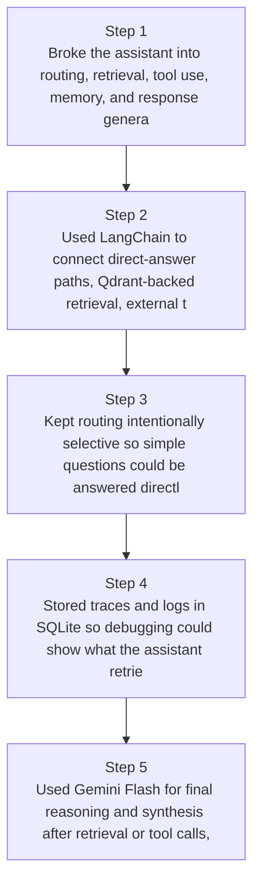
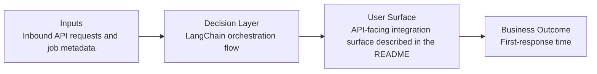
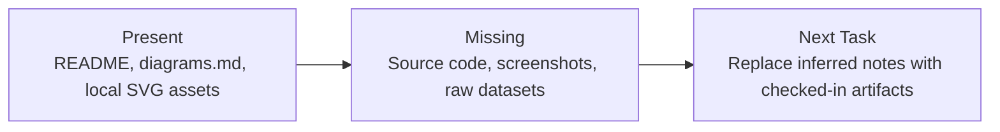

# Retrieval & Tool-Use Assistant Diagrams

Generated on 2026-04-26T04:29:37Z from README narrative plus project blueprint requirements.

## Routing decision tree

## LangChain orchestration flow

## Evidence Gap Map

